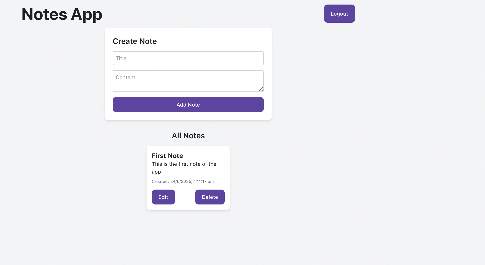

# Notes Fullstack App

A full-stack notes application built with a React frontend and Node.js/Express backend. Users can register, log in, and manage their notes securely.

## Live Demo

[Try the app here!](https://notes-fullstack-dg5gc2hfs-sanchit029s-projects.vercel.app/)

## Features

- User authentication (register & login)
- Create, read, update, and delete notes
- Responsive and modern UI
- Secure backend with JWT authentication

## Tech Stack

- **Frontend:** React, Vite, CSS
- **Backend:** Node.js, Express, MongoDB, JWT

## Getting Started

### Prerequisites

- Node.js & npm
- MongoDB

### Installation

1. **Clone the repository:**
   ```sh
   git clone https://github.com/your-username/notes-fullstack.git
   cd notes-fullstack
   ```

2. **Install backend dependencies:**
   ```sh
   cd backend
   npm install
   ```

3. **Install frontend dependencies:**
   ```sh
   cd ../frontend
   npm install
   ```

### Environment Variables

- Create a `.env` file in the `backend` directory with:
  ```
  MONGO_URI=your_mongodb_connection_string
  JWT_SECRET=your_jwt_secret
  ```

### Running the App

1. **Start the backend server:**
   ```sh
   cd backend
   npm start
   ```

2. **Start the frontend dev server:**
   ```sh
   cd frontend
   npm run dev
   ```

3. Open [http://localhost:5173](http://localhost:5173) in your browser.

## Project Structure

```
Notes-Fullstack/
  backend/
    models/
    routes/
    middleware/
    server.js
  frontend/
    src/
      pages/
      assets/
    public/
    App.jsx
    main.jsx
```

## Screenshots

Here are some screenshots of the app:


*Login page of the Notes App*


*Dashboard showing user notes*

## License

MIT
